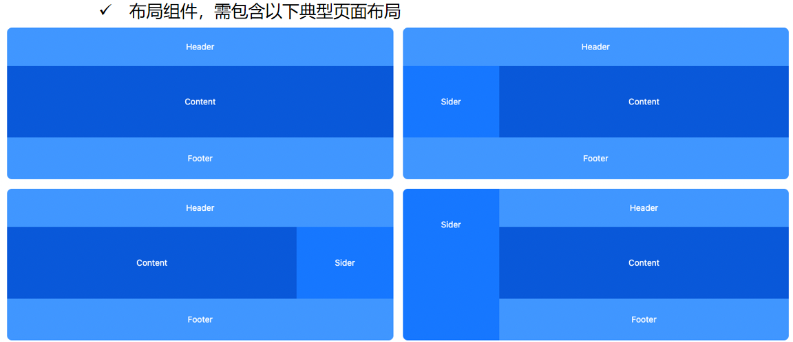

# components-lib
qige‘s components lib for Lightweight Platform homework

# 组件
- 主题色
	- 主体色，边框色 
	- todo 可以做个调色盘
- 布局组件
	- 
- button
	- 主按钮
	- 次按钮
	- 虚线按钮
	- 文本按钮
	- 链接按钮
	- block按钮以及不可用按钮
	- hover事件
- 表单组件
	- **文本输入框（Text Input）**：允许用户输入单行文本。
	- **密码输入框（Password Input）**：与文本输入框类似，但输入内容会被隐藏。
	- **多行文本框（Textarea）**：允许用户输入多行文本。
	- **单选按钮（Radio Buttons）**：允许用户从一组选项中选择一个选项。
	- **复选框（Checkboxes）**：允许用户从多个选项中选择多个选项。
	- **下拉菜单（Select Dropdown）**：提供一个选项列表，用户可以从中选择一个选项。
	- **日期选择器（Date Picker）**：允许用户选择日期。
	- **按钮（Button）**：用于提交表单、重置表单或执行其他操作。
- tree树形组件
	- 可折叠、可展开
- table表格组件
	- 单选、全选
	- 点击表头排序
- Pagination分页组件
	- 点击事件
	- 一页10条
	- 更多数据显示办法，可切换每页数据数量
- 标签组件
	- 不可删除组件
	- 动态配置标签
- 对话框组件
	- 打开、关闭
- Carousel走马灯组件
	- 点击左右按钮切换页面
	- 自动轮播切换
- 文件上传组件
	- 选择文件
	- 删除文件
	- 图片上传